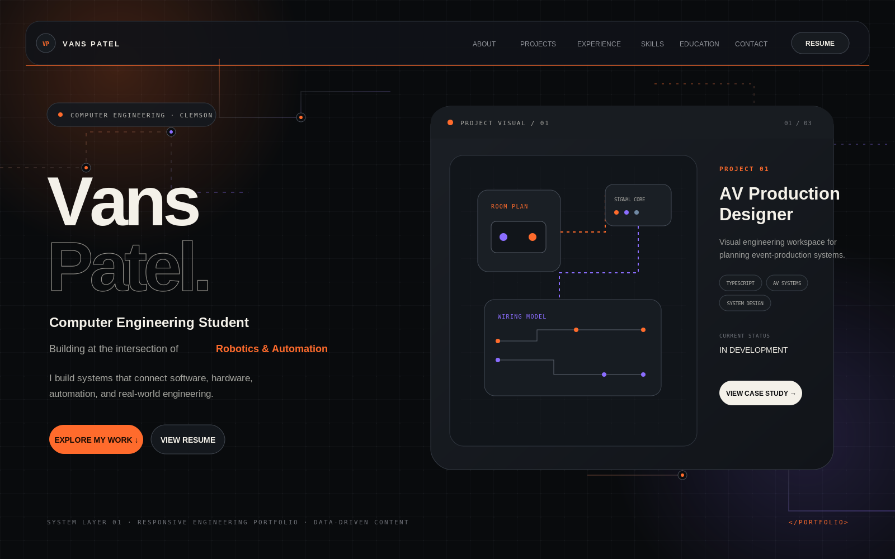

# Vans Patel Portfolio

A production-ready, data-driven Computer Engineering portfolio built for recruiters and technical reviewers. The site presents work across robotics, industrial automation, computer vision, embedded systems, software products, and live AV technology through a single long-form engineering narrative.

> The repository ships with custom vector placeholder art and conservative starter content. Replace the profile image, résumé, public contact links, and any project details you want to refine before launch.



## Features

- Cinematic but restrained engineering hero with animated PCB-style traces
- Active-section navigation, blurred header, and scroll progress indicator
- Scroll-driven desktop project showcase with mobile project stories
- Full-screen accessible case-study modal with Escape support and focus trapping
- Data-driven project filters and automatic empty-field handling
- Experience timeline, skill categories, optional proficiency bars, and capability matrix
- Clemson education credential section
- Optional certification section that stays hidden until populated
- Leadership and outside-the-classroom engineering stories
- Interactive terminal easter egg with clickable commands
- Reduced-motion support, keyboard navigation, visible focus states, and semantic landmarks
- Responsive layouts for phones, tablets, laptops, large monitors, and 4K displays
- GitHub Pages subpath handling and automatic deployment workflow
- SEO metadata, runtime canonical URL, JSON-LD, favicon, and social preview art

## Technology

- React
- TypeScript in strict mode
- Vite
- Tailwind CSS
- Framer Motion
- Lucide React
- GitHub Actions and GitHub Pages

## Local development

```bash
# Node 22 is recommended (see .nvmrc)
git clone https://github.com/USERNAME/REPOSITORY.git
cd REPOSITORY
npm install
npm run dev
```

Open the local URL printed by Vite.

Production validation:

```bash
npm run lint
npm run build
npm run preview
```

## Editing portfolio content

All portfolio content lives in typed files under `src/data/`. Components render those files automatically.

```text
src/data/
  personal.ts
  projects.ts
  experience.ts
  skills.ts
  education.ts
  certifications.ts
  leadership.ts
```

### Update personal information

Edit `src/data/personal.ts`.

Important launch fields:

- `email`
- `socialLinks`
- `resume.available`
- `resume.path`
- introduction, philosophy, focus areas, and contact copy

Links stay hidden when `enabled` is `false` or the URL is blank.

### Add a project

Add an object to `src/data/projects.ts`:

```ts
{
  id: 'unique-project-id',
  title: 'Project Name',
  subtitle: 'One-line technical positioning statement.',
  year: 'Current',
  categories: ['Robotics', 'Automation'],
  featured: true,
  published: true,
  status: 'In Development',
  shortDescription: 'Compact description for the project explorer.',
  description: 'Longer case-study overview.',
  problem: 'What engineering problem exists?',
  solution: 'What approach did you take?',
  role: 'Your exact role',
  challenges: ['Challenge one'],
  implementation: ['Implementation detail'],
  results: [],
  learnings: ['What you learned'],
  future: ['Planned improvement'],
  technologies: ['TypeScript'],
  coverImage: 'images/projects/unique-project-id/cover.webp',
  coverAlt: 'Descriptive image alt text.',
  images: [],
  systemFlow: [
    { label: 'Input', detail: 'Source data or physical input' },
    { label: 'Processing', detail: 'Core engineering logic' },
    { label: 'Output', detail: 'Physical or software result' },
  ],
  connections: ['Hardware', 'Software', 'Output'],
  accent: 'orange',
}
```

The project automatically appears in filters. Set `featured: true` to include it in the sticky showcase. Set `published: false` to keep a draft in the data file without rendering it.

Optional links, galleries, results, video, metrics, and architecture sections disappear automatically when omitted or empty.

### Update skills and proficiency

Edit `src/data/skills.ts`.

A skill can be shown without a rating:

```ts
{
  name: 'Python',
  category: 'Programming',
  context: 'Automation and computer-vision workflows',
  published: true,
}
```

Add a manually chosen rating only when you are comfortable publishing it:

```ts
{
  name: 'Python',
  category: 'Programming',
  percentage: 80,
  level: 'Proficient',
  years: 3,
  context: 'Automation and computer-vision workflows',
  published: true,
}
```

The animated proficiency bar appears only when `percentage` is greater than zero. The capability matrix represents project relationships, not expertise ratings.

### Add experience

Edit `src/data/experience.ts`. Use exact organizations, dates, roles, and verified accomplishments. Set `published: false` while drafting.

### Update education

Edit `src/data/education.ts`. Empty dates, organizations, and awards are hidden automatically.

### Add certifications

`src/data/certifications.ts` is empty by default so the site does not invent credentials. Add a verified entry and set `published: true`; the full section then appears automatically.

### Replace the résumé

1. Add the final PDF at:

   ```text
   public/resume/Vans-Patel-Resume.pdf
   ```

2. Open `src/data/personal.ts` and change:

   ```ts
   available: true
   ```

The navbar, hero, terminal, contact section, and footer all use that same configuration.

### Add project images

Store assets under:

```text
public/images/projects/project-id/
```

Use paths without a leading slash in `projects.ts`. See `public/images/README.md` for image guidance.

### Change theme colors

Edit the design variables at the top of `src/styles/index.css`:

```css
--background
--background-elevated
--surface
--surface-secondary
--text-primary
--text-secondary
--text-tertiary
--accent
--accent-secondary
--accent-tertiary
--status-issued
--status-warning
--status-danger
--terminal-background
--border
--border-strong
```

The major interface, animation accents, diagrams, cards, and focus states derive from those variables.

## GitHub Pages deployment

The repository includes `.github/workflows/deploy.yml`.

1. Create a GitHub repository.
2. Push this project to the `main` branch.
3. In GitHub, open **Settings → Pages**.
4. Under **Build and deployment**, choose **GitHub Actions** as the source.
5. Open the **Actions** tab and confirm the deployment workflow completes.

For a project site such as:

```text
https://USERNAME.github.io/REPOSITORY/
```

`vite.config.ts` automatically detects the repository name inside GitHub Actions and sets the correct Vite base path. Local development still uses `/`.

Optional repository variables under **Settings → Secrets and variables → Actions → Variables**:

- `VITE_SITE_URL` — the final public origin, such as `https://USERNAME.github.io`
- `VITE_BASE_PATH` — override the calculated path when necessary

## Custom domain

To move later to a domain such as `vanspatel.com`:

1. Add the domain in **Settings → Pages → Custom domain**.
2. Configure the DNS records shown by GitHub.
3. Add a repository variable:

   ```text
   VITE_BASE_PATH=/
   ```

4. Add a repository variable:

   ```text
   VITE_SITE_URL=https://vanspatel.com
   ```

5. Optionally add `public/CNAME` containing only:

   ```text
   vanspatel.com
   ```

No component rewrite is required.

## Content integrity

The starter site avoids fabricated employers, dates, awards, certifications, GPA, skill percentages, metrics, and project outcomes. Status labels distinguish active work, in-development systems, prototypes, and concepts. Continue that practice when editing.

## Exact first push commands

```bash
cd vans-patel-portfolio
git init
git add .
git commit -m "Build Vans Patel engineering portfolio"
git branch -M main
git remote add origin https://github.com/USERNAME/REPOSITORY.git
git push -u origin main
```

Replace `USERNAME` and `REPOSITORY` with the actual GitHub values.
